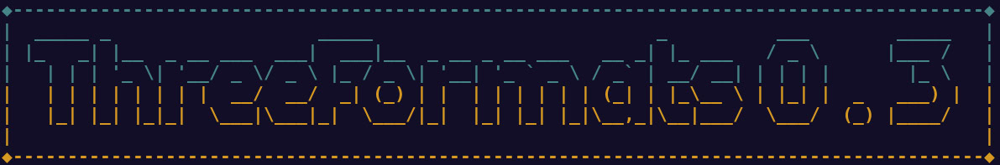

- [Про програму](/Про програму)

## Про програму
Програма створена за вимогами ```Лабораторних робіт(3.4, 3.5, 3.6, 3.7)``` предмету ```Комп'ютерна електроніка```

## [Інструкції до завантаження](https://github.com/Ge0gN0te/ThreeFormats/releases/tag/v0.3)


## Автор
Програма підготовлена студентом 315-КІ групи ```Диченком Давидом Олександровичем``` (<davyd.dychenko@kitu.nau.edu.ua>)
